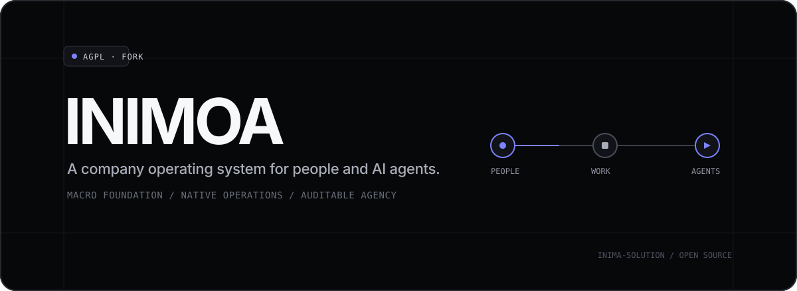

<div align="center">
  

  <br />

  <a href="#run-locally"></a>
  <a href="CONTRIBUTING.md"></a>
  <a href="https://github.com/macro-inc/macro"></a>
  <a href="LICENSE.txt"></a>

  <p><strong>One native workspace for company knowledge, communication, projects, operations, and authorized agent work.</strong></p>
  <p><sub>Independent community fork of <a href="https://github.com/macro-inc/macro">Macro</a>. Not affiliated with or endorsed by Macro or CoParse, Inc.</sub></p>
</div>

---

## What is INIMOA?

INIMOA extends Macro into a company operating system where people and AI agents work through the same projects, permissions, records, and audit boundaries. It keeps Macro's integrated work graph—mail, messages, documents, tasks, files, CRM, calls, and agents—and adds company-operation capabilities as native Macro domains instead of embedding a second product.

> [!IMPORTANT]
> INIMOA is under active development. The inherited Macro foundation is substantial, but INIMOA-specific company-operation features are not yet production-ready. The table below distinguishes implemented foundation from planned work.

<table>
  <tr>
    <td width="33%"><strong>Connected work</strong><br />Docs, tasks, messages, mail, files, CRM, calls, and agents share one linked workspace.</td>
    <td width="33%"><strong>Native operations</strong><br />Projects, approvals, calendars, people operations, and payroll are designed to live inside Macro's existing model.</td>
    <td width="33%"><strong>Auditable agency</strong><br />Human and agent actions use explicit permissions, reauthentication, and immutable business audit events.</td>
  </tr>
</table>

## Current status

| Capability | Status | Notes |
| --- | --- | --- |
| Macro workspace foundation | Available upstream | Mail, channels, docs, tasks, canvas, CRM, calls, files, search, and agents |
| Canonical task-property boundary | Implemented foundation | Focused persistence and fresh-read paths are in place |
| Company roles and permissions | In progress | Closed permission vocabulary, role bundles, persistence, and direct-human role-change API |
| Business audit and reauthentication | In progress | Append-only audit foundation and password reauthentication receipts |
| Membership lifecycle hardening | Active work | Removal/rejoin, compensation, audit-failure, and concurrency gates remain |
| Operational projects and dependencies | Planned | Project views, dependency enforcement, milestones, board, and timeline |
| Team calendar and approvals | Planned | Macro-owned calendar sources and native business approvals |
| People, leave, attendance, and payroll | Planned | Permission-isolated company operations |
| Odoo integration | Planned | Native connector boundaries; Odoo is not a second system of record inside INIMOA |

## Macro foundation

INIMOA is derived from the open-source [Macro repository](https://github.com/macro-inc/macro) and intentionally preserves its core architecture:

- **SolidJS** web client with browser, desktop, and mobile surfaces
- **Rust** services and domain crates
- **PostgreSQL** as the primary relational database
- CRDT-backed collaborative documents and a bidirectional entity graph
- Existing search, realtime, notification, file, calendar, and agent infrastructure

The `upstream` Git remote points to `macro-inc/macro` for source attribution and future upstream synchronization. INIMOA-specific work should extend Macro's native entities and interaction patterns rather than introducing a parallel shell, identity model, or database.

## Architecture at a glance

```text
People + authorized agents
            │
            ▼
   Macro-native web surfaces
            │
            ▼
  Rust domain / port / adapter crates
            │
      ┌─────┴─────┐
      ▼           ▼
 PostgreSQL   Existing platform services
              search · realtime · files · notifications
```

## Run locally

This is a large monorepo with pinned Rust, JavaScript, Nix, database, and service dependencies. Start with the upstream-compatible local setup guide:

1. Read [Running locally](docs/RUNNING_LOCALLY.md).
2. Use the frontend-only route when backend changes are not required.
3. Use the local stack for database, service, permission, migration, or integration work.
4. Never commit `.env`, local agent state, credentials, build output, or private implementation plans.

Repository layout:

```text
apps/       SolidJS web, desktop/mobile shell, and public product docs
crates/     Rust domain libraries, models, persistence, and adapters
services/   Deployable services, workers, and handlers
packages/   Shared TypeScript and collaboration packages
infra/      Infrastructure definitions
docker/     Local and deployment container definitions
nix/        Reproducible development inputs
tooling/    Repository automation and generators
```

## Contributing

Read [CONTRIBUTING.md](CONTRIBUTING.md) before opening a pull request. Contributions should be scoped, tested at the affected boundary, and understandable without private planning documents or local AI-agent context.

For security issues, do not open a public issue. Follow [SECURITY.md](SECURITY.md) and use GitHub's private vulnerability reporting flow.

## License and attribution

The repository is distributed under the [GNU Affero General Public License v3.0](LICENSE.txt), following the license of the Macro upstream project. Network deployment of a modified version carries AGPL source-availability obligations; review the license text before operating or distributing the software.

INIMOA preserves Macro's history and identifies the upstream project in [NOTICE.md](NOTICE.md). Component-specific and third-party notices remain authoritative for their respective files, including `apps/web/LICENSE`, `apps/docs/LICENSE`, and bundled `THIRD_PARTY_LICENSES.md` files.

Macro names, logos, hosted services, security certifications, and commercial claims belong to their respective owners and are not claims made by INIMOA.
